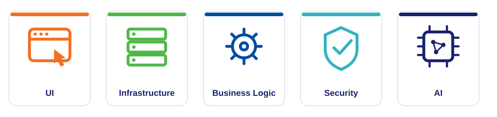
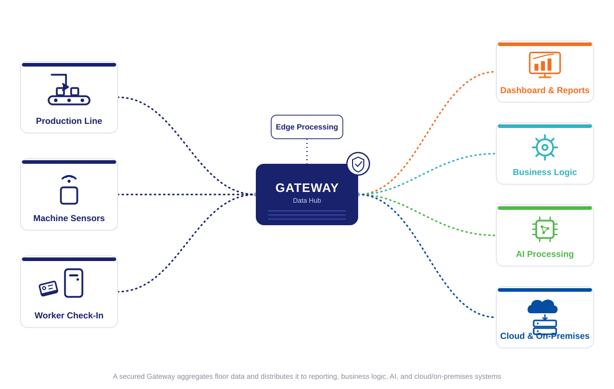
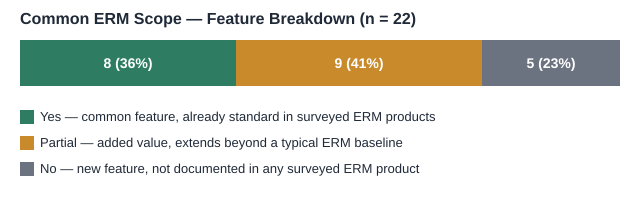
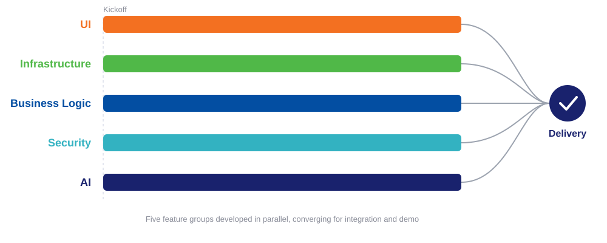

# Denso-FPT Hackathon 2026

**Project Proposal**

A proposed factory-management application for the D1, D2, and D3 technology challenges of Denso-FPT Hackathon 2026.

## About the Project

This project proposes a web-based, on-premise application for factory data collection, prediction, and reporting, developed for Denso-FPT Hackathon 2026.

- Targets the D1, D2, and D3 challenges: legacy-equipment connectivity, logistics forecasting and simulation, and production-chain impact prediction.
- Combines a web-based interface, an on-premise data platform, and offline AI/ML models.
- Positioned between common ERM/ERP practice and the hackathon's specific technical requirements.

# Project Scope

Feature groups, and how the proposal aligns with common ERM practice and the D1–D3 challenge requirements.

## Feature Groups

## Feature Deployment

## Market Research Alignment

- **Common feature.** Web access, live dashboard, manual entry, on-premise deployment, local storage, reporting, and prediction already exist in common ERM products.
- **Added value.** Drag-and-drop planning, no-code configuration, machine connectivity, multi-source ingestion, and multi-model AI go beyond a typical ERM baseline.
- **New capability.** Offline operation and offline AI inference are not documented in surveyed ERM products — potential differentiators.

## D1, D2, D3 Alignment

- **Strength.** Live dashboard, machine connectivity, multi-source collection, reporting, and prediction directly match stated D1–D3 deliverables.
- **Out-of-scope risk.** No-code configuration, multi-format support, local storage, normalization, and multi-model AI support a deliverable only indirectly; sufficiency should be verified.
- **Not requested.** UI style, deployment location, offline operation, model choice, and all security features are not asked for by D1/D2/D3; reviewers could treat them as unneeded scope.

# Strength, Weakness, and Feasibility

An assessment of the proposal's position, risks, and delivery plan.

## Strengths

- Functions like Jira for software development, or an ERM system for manufacturing, applied as a working tool for factory operations.
- Adapts to different work processes, procedures, and data types, rather than one fixed workflow.
- Provides features not yet offered by common ERM products, based on market research.
- Can be tailored to different factories and different requests.
- Local server, on-premise AI, and secured deployment protect proprietary production data.

## Weaknesses and Mitigations

- **Large scope, short timeline.** Many features across five groups must be built quickly. *Mitigation:* parallel production per feature group, detailed in the next slide.
- **Unrequested features may be rejected.** Capabilities beyond D1/D2/D3 may not be valued by evaluators or the customer.
- **Risk of replication.** A larger corporation or team could reproduce the application once the concept is proven.

## Feasibility

- The five feature groups — UI, Infrastructure, Business Logic, Security, AI — are separable enough to be developed in parallel.
- Parallel development shortens delivery time despite the large feature count.
- Each group can be assigned to a separate work stream, reducing the risk from the short timeline identified as a weakness.

## Next Steps

**If this proposal is approved:**

- **Scope input.** Each member provides rationale on their group's scope — further limits or expansions — and notes whether hardware is needed.
- **Requirements and feasibility.** Each member provides a list of requirements, a feasibility study, the tech stack, and relevant core competencies.
- **Estimation.** Each member provides a time estimate and the monthly AI subscription cost.

# Thank you!

Proposed Manufacturing ERM Application · Denso-FPT Hackathon 2026
