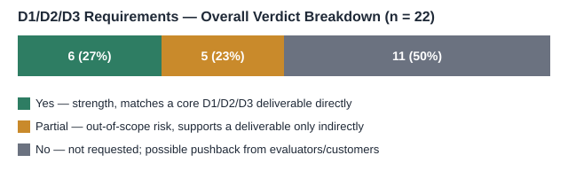
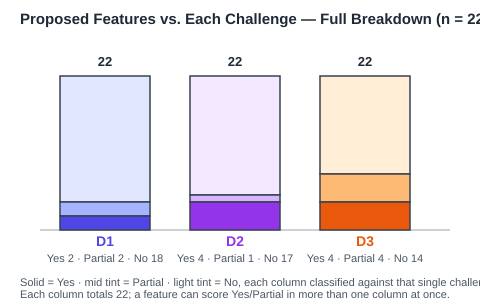

# Proposed Application — Alignment with Common ERM Scope and D1–D3 Challenges

## Introduction

**Purpose.** This document assesses whether the proposed application's features, as listed in `03_RA_Proposed_Application_Scope.md` [3], fit within (1) the common ERM feature scope described in `01_RA_ERM_Market_Research.md` [1], and (2) the D1/D2/D3 challenge requirements analyzed in `02_RA_D1D3_ERM_Alignment.md` [2].

**Scope.** This assessment maps proposed features to statements already recorded in [1], [2], and [3]. It introduces no new external research, does not evaluate technical feasibility, and does not recommend implementation choices. Each proposed feature is evaluated independently against each of the two references; a feature can score differently in each table (e.g. common to ERM but not asked for by D1–D3, or vice versa).

**How to read Yes / Partial / No.** The same verdict carries a different implication depending on which table it appears in:

- **Table 1 (Common ERM Scope).** A No or Partial does not mean a contradiction, gap, or weakness. [1] describes what ERM products commonly *already* do; a feature outside that scope simply lies beyond typical ERM coverage. It may represent a new capability, a differentiator, or an added value the proposed application offers beyond a common ERM baseline.
- **Table 2 (D1/D2/D3 Requirements).** A No or Partial carries a different meaning. Since D1, D2, and D3 define the actual challenge requirements, a No or Partial there can indicate the feature is irrelevant to the stated challenge scope (effort spent outside what is being evaluated), or a risk — a requirement or deliverable that the proposed application does not clearly address.

---

## 1. Alignment with Common ERM Scope

Basis for this table: the common-feature list in [1], Section 1, plus directly relevant statements elsewhere in [1] (vendor features in Section 2, deployment/security discussion in Section 5) where a proposed feature is not covered by Section 1 alone.

Reading note: No/Partial here indicates a feature outside common ERM coverage, not a deficiency — see "How to read Yes / Partial / No" above.

| Group | Proposed Feature ([3]) | Matches Common ERM Feature? | Basis ([1]) |
|---|---|---|---|
| UI | Web-based application | Yes | Cloud/SaaS deployment, the dominant current ERM delivery model, is inherently browser-accessed — [1], Section 1, "Deployment flexibility." |
| UI | Drag-and-drop plan/work-process builder | Partial | Production planning/scheduling is a common ERM capability (e.g. embedded PP/DS, [1] Section 2), but a drag-and-drop authoring UI for it is not documented anywhere in [1]. |
| UI | No-code data configuration (no protocol knowledge needed) | Partial | ERM's modular, configurable architecture ([1], Section 1, "modular architecture") supports user-level configuration in general, but a protocol-agnostic, no-code data-source setup screen specifically is not documented. |
| UI | Live data view | Yes | Matches "Reporting and analytics, ranging from static reports to embedded BI dashboards" — [1], Section 1; reinforced by real-time in-memory processing documented for SAP S/4HANA — [1], Section 2. |
| UI | Manual data input | Yes | Manual transaction/data entry is intrinsic to core ERM modules (finance, inventory, procurement) — [1], Section 1. |
| Infrastructure | On-premise deployment | Yes | "Several retain an on-premise or hybrid option" — [1], Section 1; confirmed per-vendor for SAP, Infor CSI, Epicor, IFS, QAD, Odoo — [1], Section 2. |
| Infrastructure | Machine connectivity layer (collect data from machines) | Partial | ERM vendors document a connectivity layer that receives floor/IoT data (SAP Plant Connectivity, IFS MQTT/SOAP/EDI) — [1], Section 3 — but per [1]'s own Scope, building the device-to-network bridge itself is outside common ERM scope. |
| Infrastructure | Multiple data-source channels (check-in, camera images, sensors, files) | Partial | Sensor/IoT data ingestion is documented — [1], Section 3; file-based import (CSV/Excel) is a standard ERM data-entry path — [1], Section 1. Worker check-in and production-image capture as ERM-native data sources are not documented. |
| Infrastructure | Multi-format data support (CSV, Excel, JSON, video) | Partial | CSV/Excel import and JSON-based API integration are standard ERM practice, consistent with [1], Section 1's modular/integration model. Video/image handling is not documented anywhere in [1]. |
| Infrastructure | Local data storage | Yes | Matches "a centralized, shared database acting as a single source of truth" — [1], Section 1; on-premise hosting option — [1], Section 1/2. |
| Infrastructure | Offline operation (no outside internet) | No | Contradicts the cloud-first architecture of most surveyed vendors (Oracle Fusion/NetSuite, Plex, Rootstock are cloud-only — [1], Section 2). On-premise deployment reduces, but does not eliminate, external connectivity; no vendor is documented as designed for fully offline operation. |
| Business Logic | Data normalization pipeline | Partial | Implied by the "single source of truth... removing duplicate data entry" principle — [1], Section 1 — but not documented as an explicit ERM feature in its own right. |
| Business Logic | Reporting | Yes | Directly matches "Reporting and analytics" — [1], Section 1. |
| Business Logic | Prediction | Yes | Matches AI/ML-based forecasting documented across vendors (SAP Joule, Microsoft Copilot demand planning, Epicor Grow AI, Infor Coleman AI, Plex DemandCaster) — [1], Section 2. |
| Business Logic | Model selection (user-chosen or auto-selected) | No | Vendor AI features in [1] are described as embedded/fixed capabilities tied to a specific use case; no vendor is documented as offering user-selectable or auto-selected model choice. |
| Security | Secured local server | Partial | On-premise deployment option is documented — [1], Section 1/2 — and associated with stronger control-layer security in some analyses — [1], Section 5. "Secured local server" itself is not a named ERM feature. |
| Security | Secure connections | Partial | Cloud ERP security is discussed as a shared-responsibility model (provider secures platform, customer secures access/integration) — [1], Section 5 — but this is a described concern/practice, not a discrete product feature. |
| Security | Fully offline, no external reachability | No | Same basis as "Offline operation" above — not documented as an ERM capability; inconsistent with the cloud-only architecture of several surveyed vendors — [1], Section 2. |
| AI | Multiple model types by data type | Partial | Collectively, surveyed vendors apply different model types for different tasks (time-series forecasting, generative-AI copilots, predictive maintenance) — [1], Section 2 — but no single vendor is documented as offering a general framework for selecting model type by data type. |
| AI | Model selection (user-choice or auto) | No | Same basis as "Model selection" above — not documented in [1]. |
| AI | Prediction capability | Yes | Same basis as "Prediction" above — [1], Section 2. |
| AI | Offline inference | No | Vendor AI/copilot features documented in [1] (Joule, Copilot, Oracle AI assistants) are cloud-hosted; no vendor is documented as running AI inference fully offline. |

---

## 2. Alignment with D1, D2, D3 Challenge Requirements

Basis for this table: the per-challenge requirement/deliverable rows in [2], Section 2 ("Requirement-Level Comparison Table"). The added "Pain Point Addressed?" column is judged against each challenge's single most critical ask, as identified in [2], Section 1 (D1: low-cost legacy-PLC edge connectivity; D2: discrete-event what-if simulation; D3: impact-propagation/cause inference) — a feature can satisfy a listed requirement without resolving that harder pain point.

Reading note: No/Partial here can indicate irrelevancy to the challenge scope, or risk that a stated requirement/deliverable is not addressed — see "How to read Yes / Partial / No" in the Introduction.

| Group | Proposed Feature ([3]) | Addresses a D1/D2/D3 Requirement? | Which Challenge & Basis ([2]) | Pain Point Addressed? |
|---|---|---|---|---|
| UI | Web-based application | No | Not a requirement in any D1/D2/D3 row in [2]; those rows concern connectivity, forecasting, and data linkage, not the delivery mechanism of the UI. | No — a UI delivery mechanism does not address any challenge's pain point. |
| UI | Drag-and-drop plan/work-process builder | No | No D1/D2/D3 row in [2] asks for a plan/process-authoring UI. | No — a planning UI does not address D1's connectivity, D2's simulation, or D3's inference pain point. |
| UI | No-code data configuration | Partial | Supports D1's stated goal of a "simple, low-cost, rapidly deployable" connectivity solution and its "cost and implementation time comparison" deliverable — [2], D1 rows — though not a literal deliverable itself. | No — easing setup does not itself solve D1's low-cost legacy-PLC edge-connectivity pain point. |
| UI | Live data view | Yes | Matches D2's "Control Room-style dashboard" deliverable directly — [2], D2 row. | No — a dashboard displays results but does not perform D2's what-if simulation. |
| UI | Manual data input | No | Not requested in any D1/D2/D3 row in [2]; those rows specify automated collection (PLC data, sensor data) rather than manual entry. | No — manual entry does not address any of the three pain points. |
| Infrastructure | On-premise deployment | No | Not a stated requirement in any D1/D2/D3 row in [2]. | No — deployment location does not address connectivity, simulation, or inference. |
| Infrastructure | Machine connectivity layer (collect data from machines) | Yes | Directly matches D1's core requirement — "collect data from legacy PLCs and transmit it to a server" — [2], D1 row. | Yes — this is the edge gateway that directly targets D1's legacy-PLC-to-server connectivity pain point. |
| Infrastructure | Multiple data-source channels (check-in, camera images, sensors, files) | Yes | Supports D1's data-collection requirement and D3's "connect production-chain data through... the Manufacturing layer" requirement, which depends on data from multiple floor-level sources — [2], D1 and D3 rows. | Partial — widens data collection but does not itself solve D1's edge-cost problem or D3's impact-propagation inference. |
| Infrastructure | Multi-format data support (CSV, Excel, JSON, video) | Partial | Supports D1's data-transmission requirement and D3's data-linkage requirement, which need multiple source formats reconciled together — [2], D1 and D3 rows. | No — format handling does not solve D1's connectivity-cost problem or perform D3's impact-propagation inference. |
| Infrastructure | Local data storage | Partial | Supports D3's "Production-chain data linkage model" deliverable, which requires a place to hold linked data — [2], D3 row. Not itself a stated requirement in any row. | No — storage alone does not perform D3's impact-propagation inference. |
| Infrastructure | Offline operation | No | Not a stated requirement in any D1/D2/D3 row in [2]. | No — offline capability is unrelated to any of the three pain points. |
| Business Logic | Data normalization pipeline | Partial | Supports D3's "Production-chain data linkage model" deliverable, which requires reconciling data before it can be linked — [2], D3 row. | No — normalization prepares data but does not itself perform D3's impact-propagation inference. |
| Business Logic | Reporting | Yes | Matches D2's "Forecast, bottleneck, and action recommendation report" deliverable and D3's "Department-specific action recommendations" deliverable — [2], D2 and D3 rows. | No — reporting presents results but does not perform the underlying simulation or inference. |
| Business Logic | Prediction | Yes | Matches D2's "Predict logistics capacity" requirement and D3's "Predict Incident Impact/Cause" requirement (challenge title itself) — [2], D2 and D3 rows. | Partial — addresses D2's forecasting sub-capability but not its harder what-if simulation, nor D3's cause-inference pain point. |
| Business Logic | Model selection (user-chosen or auto-selected) | No | No D1/D2/D3 row in [2] asks for user- or system-selectable models; D2 and D3 each specify particular named techniques (Prophet/LSTM; Knowledge Graph, Rule + ML) rather than a general model-choice capability. | No — choosing between models does not itself solve D2's simulation or D3's inference pain point. |
| Security | Secured local server | No | Not a stated requirement in any D1/D2/D3 row in [2]. | No — unrelated to any of the three pain points. |
| Security | Secure connections | No | Not a stated requirement in any D1/D2/D3 row in [2]. | No — unrelated to any of the three pain points. |
| Security | Fully offline, no external reachability | No | Not a stated requirement in any D1/D2/D3 row in [2]. | No — unrelated to any of the three pain points. |
| AI | Multiple model types by data type | Partial | D2 and D3 each call for different named techniques (time-series forecasting for D2; knowledge graph and rule + ML for D3) — [2], D2 and D3 tech-stack rows — consistent with needing different model types per data type, though neither row asks for a general selection framework. | Partial — enables applying different techniques per challenge but does not guarantee D2's simulation or D3's inference capability itself. |
| AI | Model selection (user-choice or auto) | No | Same basis as "Model selection" above — not requested in [2]. | No — choosing between models does not itself solve D2's simulation or D3's inference pain point. |
| AI | Prediction capability | Yes | Same basis as "Prediction" above — [2], D2 and D3 rows. | Partial — addresses D2's forecasting sub-capability but not its harder what-if simulation, nor D3's cause-inference pain point. |
| AI | Offline inference | No | Not a stated requirement in any D1/D2/D3 row in [2]. | No — running offline is unrelated to which pain point is solved. |

---

## 3. Closing Synthesis

### 3.1 Common ERM Scope (Table 1, n = 22)

- **Common feature — Yes (8/22, 36%):** web-based access, live data view, manual data input, on-premise deployment, local data storage, reporting, and prediction are already standard in surveyed ERM products [1].
- **Added value — Partial (9/22, 41%):** drag-and-drop plan builder, no-code data configuration, machine connectivity layer, multi-source/multi-format data ingestion, data normalization, secured server/connections, and multi-model AI extend beyond a typical ERM baseline rather than falling short of one.
- **New feature — No (5/22, 23%):** offline operation, fully offline/no external reachability, and user/auto model selection are not documented in any surveyed ERM product [1] — candidate differentiators, not gaps.

### 3.2 D1/D2/D3 Requirements (Table 2, n = 22)

- **Strength — core deliverable requested (Yes, 6/22, 27%):** live data view, machine connectivity layer, multiple data-source channels, reporting, and prediction directly match stated D1–D3 deliverables [2].
- **Out-of-scope risk — Partial (5/22, 23%):** no-code data configuration, multi-format data support, local data storage, data normalization, and multi-model AI support a deliverable only indirectly; sufficiency against the literal D1–D3 ask should be verified directly, not assumed.
- **Not requested, possible denial by customers — No (11/22, 50%):** web UI, drag-and-drop builder, manual input, on-premise deployment, offline operation, model selection, all three security features, and offline inference are not asked for by D1/D2/D3 [2]; an evaluator scoring strictly against the challenge text could treat these as unneeded scope.

The chart below classifies all 22 proposed features against each challenge individually (so each column sums to 22), rather than the aggregate "any of D1/D2/D3" view above:

### 3.3 Combined Read

- **Infrastructure, Business Logic, and AI features** skew toward Table 2 strengths — they do the collecting/predicting D1–D3 actually asks for.
- **UI and Security features** skew toward Table 1's common-ERM framing, but carry the highest not-requested risk in Table 2.
- **Offline operation and offline AI inference** sit outside both tables: a differentiator against common ERM, and simply unrequested (not a risk) against D1–D3.

---

## References

[1] `01_RA_ERM_Market_Research.md` — Enterprise Resource Management (ERM) Market Research (internal document)

[2] `02_RA_D1D3_ERM_Alignment.md` — D1–D3 Technology Challenge Alignment with ERM Application Scope (internal document)

[3] `03_RA_Proposed_Application_Scope.md` — Proposed Application — Scope and Feature List (internal document)
